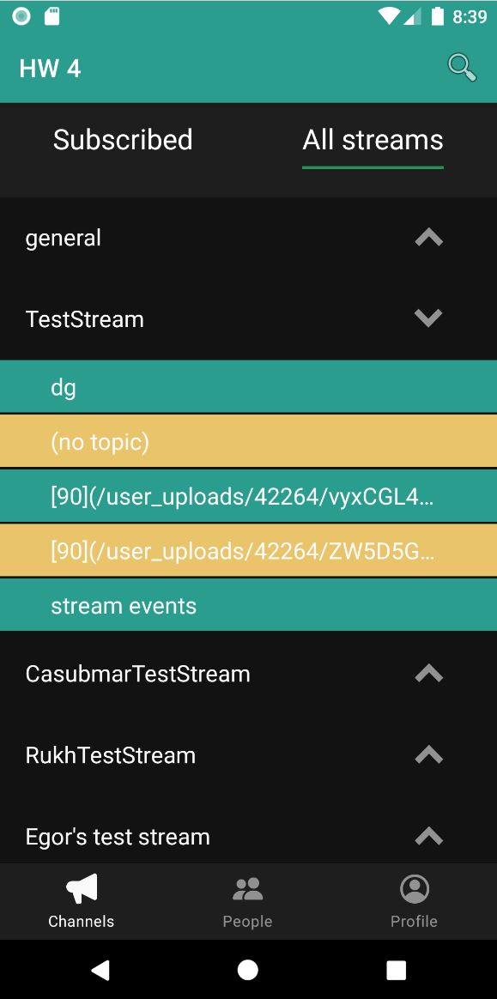
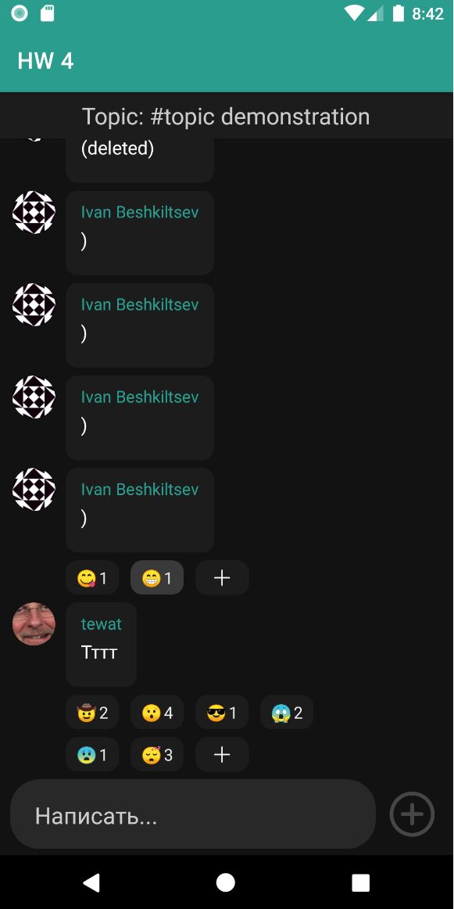

# Zulip messages APP

### Technologies used:

* Custom View, Custom ViewGroup
* Fragments API
* RecyclerView
* DiffUtils
* BottomSheetDialog со списком смайлов
* Архитектура Elmslie
* Dagger2
* RxJava
* Поиск по Стримам
* Работа с сетью, использование Zulip api
* Работа с базой данных Room
* Отправка сообщений
* Реакции под сообщениями

  
 
    
   ###  Screenshots
    
    

  
 
 

